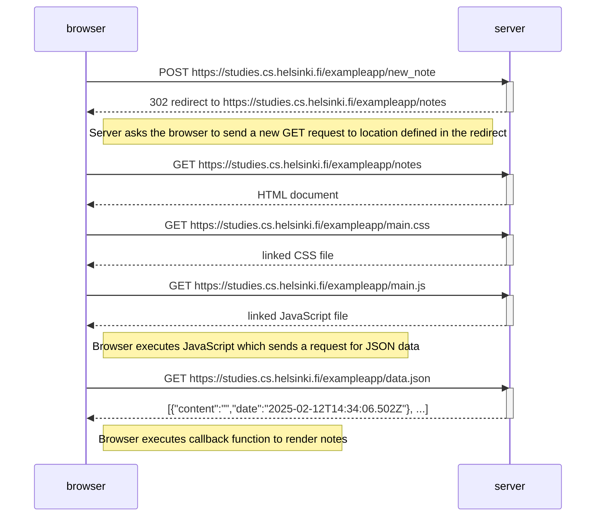

Sequence diagram for a new note using form HTTP POST:

```mermaid
sequenceDiagram
	participant browser
	participant server
	
	browser->>server: POST 	https://studies.cs.helsinki.fi/exampleapp/new_note
	activate server
	server-->>browser: 302 redirect to https://studies.cs.helsinki.fi/exampleapp/notes
	deactivate server
	
	Note left of server: Server asks the browser to send a new GET request to location defined in the redirect
	
	browser->>server: GET https://studies.cs.helsinki.fi/exampleapp/notes
	activate server
	server-->>browser: HTML document
	deactivate server
	
	browser->>server: GET https://studies.cs.helsinki.fi/exampleapp/main.css
	activate server
	server-->>browser: linked CSS file
	deactivate server
	
	browser->>server: GET https://studies.cs.helsinki.fi/exampleapp/main.js
	activate server
	server-->>browser: linked JavaScript file
	deactivate server
	
	Note right of browser: Browser executes JavaScript which sends a request for JSON data
	
	browser->>server: GET https://studies.cs.helsinki.fi/exampleapp/data.json
	activate server
	server-->>browser: [{"content":"","date":"2025-02-12T14:34:06.502Z"}, ...]
	deactivate server
	
	Note right of browser: Browser executes callback function to render notes
```
