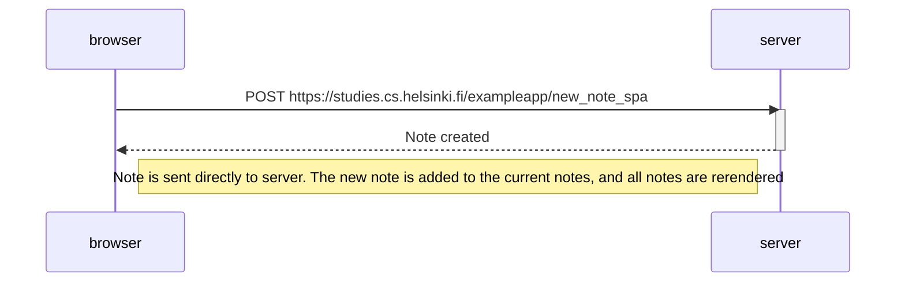

Sequence diagram for a new note on SPA notes app:

```mermaid
sequenceDiagram
	participant browser
	participant server
	
	browser->>server: POST https://studies.cs.helsinki.fi/exampleapp/new_note_spa
	activate server
	server-->>browser: Note created
	deactivate server
	
	Note right of browser: Note is sent directly to server. The new note is added to the current notes, and all notes are rerendered
```
